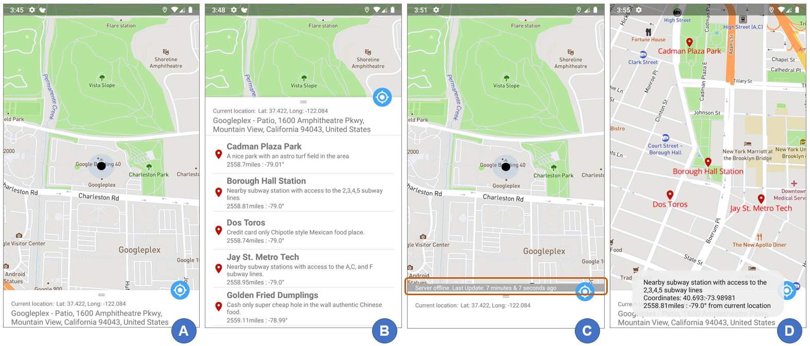
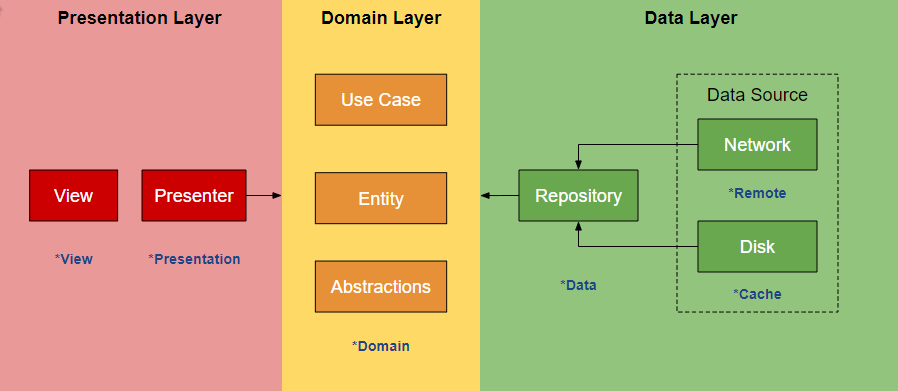

# Mapbox App
A sample Android app that implements a MapBox map using *Clean Archecture* principles with *MVVM* design pattern.
# Technical Objectives
The app requirements are very basic, but my objective is not to come up with the simplest/easiest implementation. Although seemingly over-engineered (and it is for this case), my objective was to design it with a modern architecture that is very compliant with a team development setting. Thus, I have set the following goals for the app
* Adheres to *Clean Architecture* design principles
* Modular, scalable, flexible (adaptable to future growth and requirements)
* Multi-module design composed of independent modules that can be replaced without changing the entire system.
   * For instance, the UI module  can be changed without affacting the business and data layers of the application
   * Modules and classes with well defined responsibility and separation of concerns
* Highly testable
* Uses the latest technology stack where applicable

# App Overview/Features



* When the app is opened for the first time, it will ask the user to provide access to *location permission request*. This is required to detect and display the user's current location.
* If a user grants permission, the app navigates to the user's current location. It will query the Mapbox API for the closest name of the current location (`screenshot A`).
* The app downloads map geo information in JSON format from the internet.
* The app stores this information on the local phone database for cache purposes.
* The app also stores a timestamp of when this information was saved.
* The geo information is displayed as a list inside a `bottomsheet` slider panel, shown with its distance/bearing to your current location. It is collapsed by default but can be expanded by sliding up (`screenshot B`)
* The geo list is also displayed in the Map using *location pin* icons with a text underneath that shows the item name.
* Clicking on an item list causes the map to navigate to the item location.
* Clicking on a pin icon shows the pin's description, GPS coordinates, and distance/bearing from your current location (`screenshot D`).
* Clicking on the GPS icon navigates the user back to his current location on the map. The user's coordinate is also presented.
* If the user opened the app and it failed to download geo information, the app will check it's local database for the most recent information and use it instead to display the table and map information described previously.
* It will also display how much time has elapsed since the cached information was saved (`screenshot C`).
* The app handles orientation changes gracefully, using `ViewModel` to retain states.

# App Architecture



The app architecture  is organized into several layers, namely the *presentation*, *domain*, and the *data* layers.

* **Presentation**- contains the View and Presentation modules of the app. The view module contains the activities and fragments that are coordinated through the Presenter/ViewModel. I am using the Android ViewModel class (Android Jetpack) which  is designed to store and manage UI-related data in a lifecycle conscious way. This ViewModel class allows data to survive configuration changes such as screen rotations. This layer depends on the Domain layer.
* **Domain**- is the core of our application, that contains the business logic. It should not depend on how the data will be presented or where the data is coming from, as such,  this is the most inner part that has no dependencies to the outer layers. It defines Use Cases which define operations that can be performed. It is purely a Kotlin library with no Android dependencies. The domain calls for subscribing it's observers into the main UI thread, for this, I created an abstraction for the main thread that will be implemented in the UI module (via *AndroidSchedulers.mainThread*) so that the domain layer can be free of the Android framework
* **Data**- contains the repository implementations, and is also responsible for coordinating data from the two data sources being used by the app- namely the network data source and the local storage data source. The network data will be setup and accessed using the Retrofit library. The local data source will be setup and accessed using the Room Library (JetPack).

In general, this architecture is probably best described as an **MVVM pattern with Clean Architecture**. Key advantages of these are:
* Enables future stability as more features or functions are added later on. For example, when adding a new query required on a ViewModel controller, a new user case can be added on the domain layer, which will then be implemented by someone (or the same person) working on the data layer.
* Helps eliminate frictions between teams working on a project, promotes accountability in a collaborative way.
* Allows each modular layers to be separately tested leading to a more robust and high quality product.

## Use of reactive programming
The app adopts principles of reactive programming through use of *observables* and *observers* and *schedulers*. For example, the presentation layer waits to be notified by the domain layer when a network call is made. The UI layer waits to be notified by `livedata` objects to display view changes. Many of this calls has to be performed asynchronously and schedulers helps with thread management, such as using RxJava's `observeOn` to tell observers which thread they should run on. My goal was to end up with a more cleaner, readable, and structured code base and this helped a lot.

# Libraries Used

## Mapbox SDK
Used to download street maps, feature information for the user's current location and plotting a list of geolocation information inside the map.

## Dagger 2
The app use Dagger with *AndroidInjector* module for dependency injection. The app module is responsible for the concrete creation of the Dagger objects outside of their own modules. As a general practice, all dependencies are injected into classes. That is, classes should have specific responsibilities and not be responsible for creating it's own dependencies. This loose coupling approach also helps improve the testability of the app.

The modules are organized into the following:
* *AppModule* - Responsible for creating application context dependent objects, such as SharedPreferences
* *CacheModule* - Responsible for creating the Room Database object, as well as the local database access object
* *DataModule* - Responsible for creating the concrete implementaion of the data repository object defined on the domain layer
* *MapModule* - Responsible for concretizing Map/Location services/objects
* *RemoteModule* - Responsible for creating the Retrofit service, as well the remote server access object
* *UiModule* - Responsible for injecting into Android frameworks, such as fragments, activities and services. Also responsible for binding the domain scheduler into the main UI thread
* *ViewModelModule* - Responsible for concrete instantiation of ViewModel classes
* *ViewModelFactoryModule* - responsible for creating the ViewModelFactory required to instantiate and inject dependencies into Android ViewModels
## Retrofit
 I am using Retrofit as client service to accessing server data. Retrofit makes it relatively easy to retrieve JSON via a REST based webservice. Although the actual Json data required for this app is very simple, using Retrofit allows the app to scale more convenienty as more data structures or server requests are required. There are 2 Retrofit clients on this app:
 * Test Server client - for obtaining the geo location information that is displayed on the map and the slider panel
 * Mapbox client - for obtaining Mapbox feature information for the detected user GPS coordinates.
## RxJava
RxJava is used extensively for composing asynchronous calls to the remote/local data sources by using observable chains and sequences. For instance, during the process of displaying a pre-defined list of geo-information to the user, the app implements the following flow: 
* get data from the remote server
* store the data into the local database
* store the timestamp for the data into the local atabase
* check the local database for the most recent location information during connectivity issues
* if cached information is being used, also display how much time has elapsed since the test server was succesully queried.
* notify the UI observers when the information is readily available, or an error has been detected

The code below illustrates how RxJava observables are chained to implement the flow described above.
```kotlin
override fun getMapPoints(): Observable<MapInformation> {
        return dataStore.getRemoteData(true).getMapPoints()
            .map { list ->
                MapInformation(
                    mapPoints = list.map { mapper.mapToDomain(it) },
                    source = Source.REMOTE,
                    timeStamp = timeUtils.currentTime
                )
            }
            .map { information ->
                val list = information.mapPoints.map { mapper.mapToData(it) }

                val updateLastLocationTimeStamp = dataStore.getRemoteData(false)
                    .updateLastLocationTimeStamp(information.timeStamp)

                dataStore.getRemoteData(false)
                    .saveMapPoints(list)
                    .andThen(updateLastLocationTimeStamp)
                    .andThen(Observable.just(information))
            }
            .onErrorResumeNext { t: Throwable ->
                Observable.zip(
                    dataStore.getRemoteData(false).getLastLocationTimeStamp(),
                    dataStore.getRemoteData(false).getMapPoints(),
                    BiFunction<Long, List<MapPointData>, Pair<Long, List<MapPointData>>> { t1, t2 ->
                        Pair(t1, t2)
                    })
                    .map { pair ->
                        Observable.just(
                            MapInformation(
                                mapPoints = pair.second.map { mapper.mapToDomain(it) },
                                source = Source.CACHE,
                                timeStamp = pair.first
                            )
                        )
                    }
            }
            .flatMap { it }
    }
```
## Unit Testing
JUnit4, Mockito, Room-in-memory testing was used for tests included. For example, to unit test the RXJava call above, the data repositories are mocked using Mockito. Due to dependency injection, there are very loose coupling between classes which makes it very suitable for comprehensive unit testing coverage.
## LeakCanary
LeakCanary was used to detect and anticipate potential memory leaks. The app yielded 0% memory leaks through extensive debug testing.
## Android Jetpack
Jetpack is a suite of libraries, tools, and guidance to help developers write high-quality apps easier. Many Jetpack libraries are used in this application.
### Room Library
The app uses Room Library (Jetpack) to store and access SQLite database information on the device. SQLite is being used to cache the map information information- which will be accessed when the device cannot connect to the network to obtain map information.
### Data Binding
Data binding is leveraged heavily. It was used to bind observable data to UI elements directly in the XML layouts, minimizing boilerplate code in the fragments or activities employing them. It also eliminates the need to setup click listener callbacks in some casses, such as when passing click events and data binding variables to receiving methods, such as `mapInfo` embeded on the RecyclerView `viewholders`.
### Lifecycle-Aware Components
Helped keep UI controllers (activities and fragments) as lean as possible. For instance, the MapBox library which is heavily reliant on lifecycle states (`onCreate`, `onStart`, `onDestroy`, etc.) was able to employ the use of lifecycle observers allowing them to be cleanly separated on its own.
### ViewModel
Helps decouple the control logic from the UI elements in a lifecycle conscious way. Presentation layer calls to the domain calls are done through the ViewModels.
### LiveData
It helped in supporting the reactive programming approach that supported the clean architecture design of the app. The live data was used as *observables* that notifies its *observers* (view elements) when something needs to be updated.
### Navigation
Specifically navigation graph was used to place content inside the main container, called a `NavHost`. The app only has a single view, but as more views are added, a 'NavController' can be used to orchestrate the swapping content in the `NavHost`.
## Other Libraries used
* Kotlin Coroutines
* Kotlin Serialization

# Dependencies setup
Multiple libraries are used in this app. To mantain consistency and coherence, a single source of library versions is used and is contained in the projects `build.gradle` file. Also, since this app uses a multi-module architecture, it ensures that when a library updates, all modules using the same library are updated to thelatest version.

```
 ext{
        //Android Libraries
        appcompat_version = '1.1.0'
        ktx_version = '1.1.0'
        lifecycle_version = '2.1.0'
        viewmodel_version = '2.2.0-alpha05'
        room_version = '2.2.0-rc01'
        constraint_layout_version = '1.1.3'
        cardview_version = '1.0.0'
        nav_fragment_version = '2.2.0-alpha03'

        //3rd Party Libraries
        javax_inject_version = '1'
        dagger_version = '2.22.1'
        retrofit_version = '2.6.0'
        okhttp_version = '3.12.3'
        rxandroid_version = '2.1.1'
        rxkotlin_version = '2.3.0'
        rxjava_version = '2.2.9'
        leakcanary_version = '2.0-beta-3'
        mapbox_version = '8.4.0'
        mapbox_turf_version = '4.9.0'
        kotlin_serialization_version = '0.11.1'

        //Test Libraries
        junit_version = '4.12'
        androidx_test_runner_version = '1.2.0'
        espresso_version = '3.2.0'
        mockito_kotlin_version = '2.1.0'
```

# References
* Mapbox Android SDK: https://docs.mapbox.com/android/maps/overview/
* Clean Architecture: https://proandroiddev.com/how-to-implement-a-clean-architecture-on-android-2e5e8c8e81fe
* Guide to App Architecture: https://developer.android.com/jetpack/docs/guide

